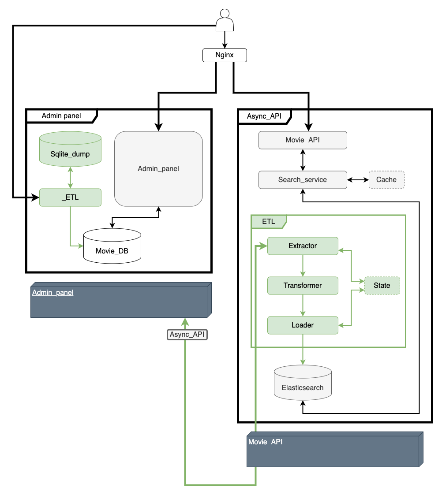

# Movie api

Admin panel - Иньерфейс взаимодействия с БД, миграции средствами Django и использование отказоустойчивого ETL процесса переноса данных из SQLite в PostgreSQL и Elasticsearch, кеширование запросов с использованием Redis.

Movie api - API для сайта с информацией о фильмах, реализация непрерывного и отказоустойчивого ETL пайплайна, в котором создаются и заполняются индексы из данных PostgreSQL в Elasticsearch, обработка и кеширование запросов к Elasticsearch.

## Схема проекта

## Работа с проектом

### Запуск приложения Admin panel

1. Создать файл конфигурации `.env` по пути `movie/src` и заполнить его согласно `movie/src/.env.example`
2. Запустить контейнер командой
   `$ docker-compose -f movie/src/docker-compose.yml up`

### Запуск ETL

1. Создать файл конфигурации `.env` по пути `etl/` и заполнить его согласно `etl/.env.example`
2. Запустить контейнер командой
   `$ docker-compose -f etl/docker-compose.yml up`

### Запуск приложения Movie api

1. Создать файл конфигурации `.env` в корне проекта и заполнить его согласно `example.env`
2. Запустить контейнер командой
   `$ docker-compose up`
